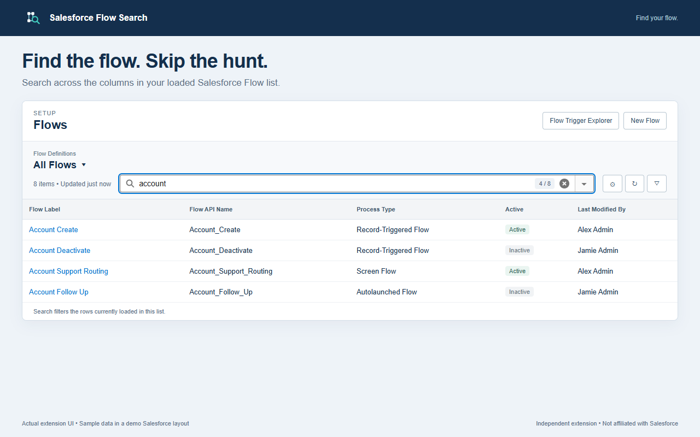

# Salesforce Flow Search

Search loaded Salesforce Flow-list rows, narrow the same query to selected columns, and control row loading.

## Features

- All-column search with Flow-name and Flow-name/API-name defaults.
- Multiple column choices with full-row controls.
- Automatic loading, stop and resume.
- Preferences saved locally across tabs.
- Configurable Salesforce page paths; native FlowRecord search remains.
- No analytics, developer-server uploads or Salesforce API calls.

Search covers loaded rows and values exposed in the page. Automatic loading scrolls the current list. Salesforce layout changes and table virtualization can affect compatibility. Store screenshots use actual extension UI with fictional records in a demo layout.

## Local installation

Open chrome://extensions, enable Developer mode, and Load unpacked using the extension folder. For an already-installed unpacked copy, replace files in its existing folder, click Reload, and refresh Salesforce to keep the same local installation.

## Build and validate

Run node scripts/check-package.cjs. On Windows, run powershell -File scripts/build-upload.ps1 to create the upload ZIP. The extension has no runtime build step or dependencies. Optional screenshot rendering uses npm install followed by npm run render-assets and a locally installed Chrome browser. Dev dependencies are used only for rendering, not bundled into the extension.

## GitHub Pages

In repository Settings > Pages, choose Deploy from a branch, main and /docs. GitHub will show the final Pages URL. Use its /privacy.html page in the Chrome Web Store privacy-policy field. docs/index.html is the homepage. No credentials or Salesforce data are needed to host these static pages.

## Support and privacy

Contact salesforceapiformatter@gmail.com. See [Privacy policy](docs/privacy.html), [store listing](listing/store-listing.txt), [privacy disclosures](listing/privacy-practices.txt), and [reviewer instructions](review/reviewer-instructions.txt).

Independent extension; not affiliated with or endorsed by Salesforce. Original logo assets are included in brand. No original extension publisher assets or Salesforce logos are bundled. Store publication and a public privacy-policy URL still need to be completed by the publisher.
